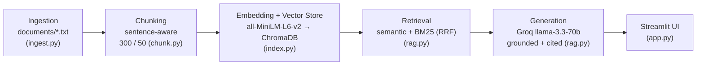

# 🏠 The Unofficial Guide — GMU Off-Campus Housing (RAG)

A Retrieval-Augmented Generation system that answers plain-language questions about
**off-campus housing near George Mason University** using real tenant reviews and
listings — with **grounded, cited answers** and a refusal to guess when the sources
don't cover the question.

> 🔗 **Live demo:** _added after deployment to Streamlit Community Cloud_
> 📸 _Screenshot/GIF: add `docs/demo.gif` and embed here_

Ask *"Which complexes near GMU have pest problems?"* and get:
> Layton Hall [1] (cockroaches, mice, bedbugs) and Oakton Park [2] ("absolutely infested with German cockroaches"). — with the source reviews one click away.

---

## What it does

- **Ingests** 10 documents of GMU housing knowledge (tenant reviews + listings) from `documents/`.
- **Chunks** them sentence-aware and **embeds** them locally (all-MiniLM-L6-v2).
- **Retrieves** with a **hybrid** of semantic search (ChromaDB) + keyword search (BM25), fused via Reciprocal Rank Fusion.
- **Generates** an answer with **Groq llama-3.3-70b** that is grounded only in the retrieved chunks and **cites its sources**.
- Serves it through a **Streamlit** web UI with an expandable Sources panel.

## Architecture



## Quickstart (local)

```bash
python -m venv .venv && source .venv/bin/activate
pip install -r requirements.txt
cp .env.example .env          # then put your free Groq key (console.groq.com) in .env

python index.py               # build the vector store (downloads the embedding model once)
python rag.py "which complexes have cockroaches?" --answer   # CLI
python evaluate.py            # run the evaluation report
streamlit run app.py          # web UI
```

---

## Domain

**Off-campus housing for George Mason University students (Fairfax, VA).**

When a GMU student looks for an apartment, the *official* sources — property websites, the GMU off-campus portal, listing aggregators — tell you rent, floor plans, and amenities. What they don't tell you is what living there is actually like: whether a building has a cockroach problem, whether management ignores maintenance tickets, whether the walls are paper-thin, or whether "visitor parking" really exists. That experiential knowledge is buried across thousands of scattered tenant reviews and Reddit threads. This system makes that tenant-generated knowledge searchable and answerable, with citations.

## Document Sources

10 documents spanning lived experience (tenant reviews) and logistics (listings/commute). Reddit and several review sites (ApartmentRatings, Yelp, apartments.com) block automated access, so the review documents were **compiled from review content indexed via web search**, with the underlying source URLs recorded in each file's header (`SOURCE:` line).

| # | Source | Type | URL or file path |
|---|--------|------|------------------|
| 1 | ApartmentList — rent ranges near GMU | Factual listing | `documents/factual_apartmentlist_near_gmu.txt` · apartmentlist.com |
| 2 | GMU Off-Campus Housing portal | Factual listing | `documents/factual_gmu_och_listings.txt` · och.gmu.edu |
| 3 | Masonvale tenant reviews | Tenant reviews | `documents/review_masonvale.txt` · Yelp/Birdeye |
| 4 | Fairfax Square tenant reviews | Tenant reviews | `documents/review_fairfax_square.txt` · ApartmentRatings/Birdeye |
| 5 | Oakton Park tenant reviews | Tenant reviews | `documents/review_oakton_park.txt` · ApartmentRatings/Birdeye |
| 6 | The Point at Fairfax tenant reviews | Tenant reviews | `documents/review_the_point_at_fairfax.txt` · ApartmentRatings/Yelp |
| 7 | Layton Hall tenant reviews | Tenant reviews | `documents/review_layton_hall.txt` · ApartmentRatings/Yelp |
| 8 | eaves Fairfax City tenant reviews | Tenant reviews | `documents/review_eaves_fairfax_city.txt` · Birdeye/VeryApt |
| 9 | Flats & Main on University | Student housing (factual) | `documents/factual_flats_main_on_university.txt` |
| 10 | Commute & neighborhoods guide | Guide | `documents/guide_commute_neighborhoods_gmu.txt` |

## Chunking Strategy

**Chunk size:** 300 characters (≈ 50–70 tokens)

**Overlap:** 50 characters

**Why these choices fit your documents:** The corpus is short, opinion-based review text where each praise or complaint is 1–3 sentences ("infested with German cockroaches," "$100/month for an extra spot"). Small chunks keep each retrievable *thought* distinct, so a query about parking matches the parking sentence instead of being diluted by unrelated amenity text — following the guidance that review text warrants smaller chunks than long guides. The 50-char overlap preserves meaning across sentence boundaries. **Preprocessing:** each file's `SOURCE/TYPE/COLLECTED/TOPIC` header is parsed into metadata (not embedded as content), HTML entities/tags are stripped, and whitespace normalized (`ingest.py`). Chunking is sentence-aware — whole sentences are packed up to ~300 chars and never cut mid-word (`chunk.py`). Each chunk is **title-prefixed** before embedding (e.g. `"Fairfax Square: …"`) so it stays self-identifying even when a sentence omits the complex name.

**Final chunk count:** 55 chunks across 10 documents (avg 244 chars).

## Embedding Model

**Model used:** `all-MiniLM-L6-v2` (sentence-transformers) — 384-dim, runs locally, no API key, fast.

**Production tradeoff reflection:** MiniLM is small, fast, free, and good enough for short English review text, but it has a ~256-token input cap, is English-only, and is general-domain (not tuned for housing/real-estate language). Deploying for real users with no cost constraint, I'd weigh: larger hosted models (OpenAI `text-embedding-3-large`, Cohere Embed v3, Voyage) for higher accuracy and longer context; a multilingual model if the student body is international; API latency/rate limits vs. local inference; and the privacy/cost of sending tenant data to a third-party API vs. keeping embeddings local. For this project, the local model wins on cost, privacy, and zero setup.

## Grounded Generation

**System prompt grounding instruction** (verbatim, from `rag.py`):

> *You are The Unofficial Guide, a question-answering assistant for George Mason University off-campus housing. Answer ONLY using the numbered sources provided in the user message. Cite the sources you use with bracketed numbers like [1] or [2]. If the sources do not contain the answer, say you don't have that information in your sources — do not use outside knowledge and do not guess. Be concise and specific, and prefer concrete details (names, prices, specifics) from the sources.*

Structural choices that enforce grounding: the retrieved chunks are formatted as a **numbered source list** (`[1] (Title) text…`) and passed in the user message; generation runs at low temperature (0.2). Verified behavior: asked *"is the GMU housing lottery actually random?"* (not in the corpus), the system replies *"I don't have that information in my sources."*

**How source attribution is surfaced:** the model cites inline with `[n]`, and the Streamlit UI renders an expandable **Sources** panel listing each numbered chunk with its complex title, file, raw text, and original source URL.

## Evaluation Report

All 5 questions from `planning.md` were run end-to-end (`python evaluate.py`). For each: the question, the expected (ground-truth) answer, the system's **actual response** (verbatim), the chunks it retrieved, and an accuracy judgment. Full raw output is in `evaluation_results.md`.

**Q1 — Which apartment complexes near GMU have reported pest problems (cockroaches, mice, or bedbugs)?**
- **Expected answer:** Oakton Park (German cockroaches) and Layton Hall (cockroaches, mice, bedbugs).
- **System's actual response:**
  > According to the sources, the following apartment complexes near GMU have reported pest problems: (1) Oakton Park [1] — German cockroaches; (2) Layton Hall [2][5] — cockroaches, mice, and bedbugs; (3) eaves Fairfax City [4] — pest-control concerns (no specific pests mentioned).
- **Retrieved (top-5):** Oakton Park, Layton Hall, ApartmentList, eaves Fairfax City
- **Accuracy judgment:** ✅ **Accurate**

**Q2 — How much does extra or reserved parking cost at The Point at Fairfax?**
- **Expected answer:** About $100/month for an additional space and $125/month for reserved parking.
- **System's actual response:**
  > According to [1], additional parking spots at The Point at Fairfax cost about $100 per month, and reserved parking costs about $125 per month. This information is also repeated in [2].
- **Retrieved (top-5):** The Point at Fairfax, eaves Fairfax City, ApartmentList
- **Accuracy judgment:** ✅ **Accurate**

**Q3 — What is the average rent for an apartment near George Mason University?**
- **Expected answer:** About $2,680 per month.
- **System's actual response:**
  > The average rent for an apartment near George Mason University is about $2,680 per month [1, 2].
- **Retrieved (top-5):** Commute guide, ApartmentList, Fairfax Square, GMU OCH
- **Accuracy judgment:** ✅ **Accurate**

**Q4 — Which student apartments advertise free CUE bus rides to GMU?**
- **Expected answer:** The Flats on University and The Main on University.
- **System's actual response:**
  > The Flats on University and The Main on University advertise free CUE bus rides to GMU [1, 2, 5].
- **Retrieved (top-5):** Flats & Main on University, Commute guide, GMU OCH
- **Accuracy judgment:** ✅ **Accurate**

**Q5 — What do residents say about noise at eaves Fairfax City?**
- **Expected answer:** Neighbors are loud past midnight ("beds shake"); management only enforces quiet hours (10pm–8am).
- **System's actual response:**
  > Residents describe neighbors being loud past midnight, to the point that "beds shake," and say little concrete action is taken [1]. Management can only enforce noise complaints during posted quiet hours (10pm–8am) [2].
- **Retrieved (top-5):** eaves Fairfax City (all top-5)
- **Accuracy judgment:** ✅ **Accurate**

**Summary:** retrieval quality was *Relevant* and response accuracy *Accurate* for all 5 questions. A genuinely unanswerable, evaluative question is documented separately in **Failure Case Analysis** below.

**Hybrid vs. semantic-only** (full table in `evaluation_results.md`): the retrievers diverge on Q1, Q2, and Q5. The clearest win is **Q5** — hybrid kept all five chunks on *eaves Fairfax City*, while semantic-only pulled in an unrelated *Fairfax Square* chunk, showing the BM25 component sharpening proper-noun queries.

## Failure Case Analysis

**Question that failed:** *"Is Oakton Park a good place to live?"* (an intentionally evaluative question).

**What the system returned:** It declined to give an overall verdict — *"I don't have … an overall assessment"* — then summarized mostly complaints (parking, noise, management) with a brief positive.

**Root cause (tied to pipeline stages):** Two stages combine. (1) *Generation/prompt:* the grounding instruction restricts the answer to what's explicit in the sources and forbids outside judgment; no single chunk contains a holistic "good/bad" verdict, so the model won't synthesize one. (2) *Retrieval/data:* the retrieved chunks skew negative because the corpus has more specific negative detail than positive, and the aggregate 5-star rating (in the ApartmentList doc) wasn't retrieved for this query — so even the summary it gave was one-sided.

**What I would change:** add a "synthesis" mode whose prompt explicitly asks the model to weigh pros *and* cons from the retrieved context; balance retrieval so both positive and negative chunks are pulled (sentiment- or source-type-aware); and make the aggregate-rating chunk retrievable for "is X good?" queries via metadata boosting.

## Spec Reflection

**One way the spec helped you during implementation:** Deciding the chunking strategy in `planning.md` *before* coding gave the implementation a clear target — choosing small (300-char) sentence-aware chunks for short review text up front meant `ingest.py`/`chunk.py` were straightforward, and the 55-chunk result landed inside the predicted ~45–60 range with no rework.

**One way your implementation diverged from the spec, and why:** The spec didn't anticipate that mid-document chunks would lose the complex name; during M3/M4 I added **title-prefixing before embedding/BM25** (not in the original plan) to fix retrieval. The planned failure case also diverged — I expected a one-sided over-confident answer, but the system *declined* to render a verdict, revealing a different limitation (it can't answer evaluative "is X good?" questions).

## AI Usage

> ⚠️ **Personalize this section** so it reflects *your* actual involvement and decisions — it is your honest disclosure of AI use.

**Instance 1 — Ingestion & chunking**
- *What I gave the AI:* the Chunking Strategy section of `planning.md` plus a sample document.
- *What it produced:* `ingest.py` (header parsing + cleaning) and `chunk.py` (sentence-aware 300/50 chunking).
- *What I changed or overrode:* after inspecting the chunks, I directed it to **prefix each chunk's complex/title before embedding**, because mid-document chunks were losing the complex name and hurting retrieval.

**Instance 2 — Document collection**
- *What I gave the AI:* the domain (GMU off-campus housing) and target complexes.
- *What it produced:* it attempted to fetch Reddit and review sites, which returned HTTP 403.
- *What I changed or overrode:* I redirected the approach to **compile review content indexed via web search with honest provenance headers** rather than scraping, auto-fetching only the sources that allowed it (ApartmentList, GMU OCH), and leaving raw Reddit reviews for manual addition.

**Instance 3 - Written Readme and Planning md file**
- I used the Claude AI to structure the readme and Pipline md file, so I can present it better in Github.
