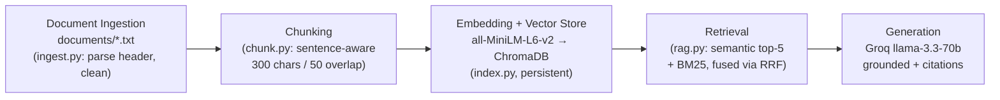

# Project 1 Planning: The Unofficial Guide

*Written before implementation (Milestone 2). Chunking and Retrieval sections will be updated if the approach changes during the build.*

---

## Domain

**Off-campus housing for George Mason University students (Fairfax, VA).**

When a GMU student looks for an apartment, the *official* sources — property websites, the GMU off-campus portal, listing aggregators — tell you rent, floor plans, and amenities. What they don't tell you is what living there is actually like: whether a building has a cockroach problem, whether management ignores maintenance tickets, whether the walls are paper-thin, or whether "visitor parking" really exists. That experiential knowledge lives in thousands of scattered tenant reviews and Reddit threads.

This system makes that tenant- and student-generated knowledge **searchable and answerable with citations**, so a student can ask "which complexes near GMU have pest problems?" and get a grounded answer instead of reading 100 reviews.

---

## Documents

10 sources covering rent/logistics (factual) and lived experience (tenant reviews) across the main complexes GMU students consider. Reddit and several review sites (ApartmentRatings, Yelp, apartments.com) block automated access, so review documents are **compiled from review content indexed via web search**, with provenance recorded in each file's header.

| # | Source | Description | Location (primary source) |
|---|--------|-------------|---------------------------|
| 1 | ApartmentList | Rent ranges + brief notes for complexes near GMU | `documents/factual_apartmentlist_near_gmu.txt` (apartmentlist.com) |
| 2 | GMU OCH portal | Official off-campus listings: rent, distance, CUE bus | `documents/factual_gmu_och_listings.txt` (och.gmu.edu) |
| 3 | Masonvale reviews | Maintenance, lease-renewal policy, "shady" office | `documents/review_masonvale.txt` (Yelp/Birdeye) |
| 4 | Fairfax Square reviews | Billing/move-out charges, sewage incident, mixed | `documents/review_fairfax_square.txt` (ApartmentRatings/Birdeye) |
| 5 | Oakton Park reviews | German cockroaches, parking, noise, management | `documents/review_oakton_park.txt` (ApartmentRatings/Birdeye) |
| 6 | The Point at Fairfax reviews | Strong management, parking fees, thin walls | `documents/review_the_point_at_fairfax.txt` (ApartmentRatings/Yelp) |
| 7 | Layton Hall reviews | Cheap rent, pests (bedbugs), low staff rating | `documents/review_layton_hall.txt` (ApartmentRatings/Yelp) |
| 8 | eaves Fairfax City reviews | Noise ("beds shake"), rent hikes, maintenance speed | `documents/review_eaves_fairfax_city.txt` (Birdeye/VeryApt) |
| 9 | Flats & Main on University | Purpose-built student housing, CUE bus, amenities | `documents/factual_flats_main_on_university.txt` |
| 10 | Commute & neighborhoods guide | CUE bus, Metro shuttle, neighborhood tradeoffs | `documents/guide_commute_neighborhoods_gmu.txt` |

---

## Chunking Strategy

**Chunk size:** 300 characters (≈ 50–70 tokens)

**Overlap:** 50 characters

**Reasoning:** The corpus is short, opinion-based review text — each praise or complaint is usually 1–3 sentences ("parking is a rat race," "infested with German cockroaches," "$100/month for an extra spot"). Small chunks keep each retrievable *thought* distinct, so a query about parking at The Point matches the parking sentence instead of being diluted by unrelated amenity text. This follows the assignment's guidance that review-style text warrants smaller chunks than long-form guides. The 50-character overlap preserves meaning across sentence boundaries (e.g., a complex name in one sentence, its complaint in the next). Splitting is **sentence-aware**: whole sentences are packed up to ~300 chars and never cut mid-word; each document's SOURCE/TOPIC header is parsed into metadata, not embedded as content. *Expected ~45–60 chunks across the 10 documents; will verify after chunking (M3) and reduce toward ~250 chars if the count falls below the 50-chunk floor or chunks read as too coarse.*

---

## Retrieval Approach

**Embedding model:** `all-MiniLM-L6-v2` (via sentence-transformers) — 384-dimensional, runs locally, no API key, fast.

**Top-k:** 5 retrieved chunks per query (enough opinions for context without diluting the prompt, since each chunk is short).

**Production tradeoff reflection:** MiniLM is small, fast, free, and good enough for short English review text, but it has a ~256-token input cap, is English-only, and is general-domain (not tuned for housing/real-estate language). If deploying for real users with no cost constraint, I'd weigh: larger hosted models (OpenAI `text-embedding-3-large`, Cohere Embed v3, Voyage) for higher accuracy and longer context; a multilingual model if the student body is international; API latency/rate limits vs. local inference; and the privacy/cost of sending tenant data to a third-party API vs. keeping embeddings local. For this project the local model wins on cost, privacy, and zero setup.

**Hybrid search (stretch feature):** Beyond semantic search, retrieval also runs a BM25 keyword search over the same chunks and fuses the two ranked lists with Reciprocal Rank Fusion (RRF), returning the top 5. Housing queries are full of proper nouns (complex names, "CUE bus," prices) that exact-match keyword search catches and embeddings sometimes miss. A `--semantic-only` toggle enables the hybrid-vs-semantic comparison reported in the evaluation.

---

## Evaluation Plan

| # | Question | Expected answer |
|---|----------|-----------------|
| 1 | Which apartment complexes near GMU have reported pest problems (cockroaches, mice, or bedbugs)? | Oakton Park (German cockroach infestation) and Layton Hall (cockroaches, mice, bedbugs). |
| 2 | How much does extra or reserved parking cost at The Point at Fairfax? | About $100/month for an additional space and $125/month for reserved parking. |
| 3 | What is the average rent for an apartment near George Mason University? | About $2,680 per month. |
| 4 | Which student apartments advertise free CUE bus rides to GMU? | The Flats on University and The Main on University. |
| 5 | What do residents say about noise at eaves Fairfax City? | Neighbors are loud past midnight ("beds shake"); management only enforces quiet hours (10pm–8am) and won't act after the office closes. |

**Planned failure case (for the report):** "Is Oakton Park a good place to live?" — the sources deliberately conflict (listing aggregators show a high star rating, while detailed reviews report roaches, bad parking, and noise). I expect the system to retrieve one side and give a one-sided or over-confident answer, which I'll document as a failure rooted in contradictory source data + summary-level chunks.

---

## Anticipated Challenges

1. **Data provenance & summary bias.** Reddit and several review sites block automated access, so most review documents are *compiled summaries* of indexed review content, not raw verbatim reviews. This can flatten nuance and introduce summary bias. Mitigation: honest source headers, optional enrichment with manually pasted raw reviews, and an evaluation that checks whether specific facts still retrieve correctly.

2. **Chunk boundaries separating a complaint from its complex name.** A chunk like "parking is inexcusable, a rat race for spots" could lose which complex it refers to. Mitigation: keep the complex name in each paragraph during cleaning, attach the source document as chunk metadata, and use overlap.

3. **Contradictory / subjective signals.** Aggregate ratings disagree with detailed reviews (Oakton Park), and reviews are inherently subjective — risking confidently one-sided answers (this is also the planned failure case).

4. **Small corpus (~50 chunks).** Fewer distractors, but little redundancy, so a single low-quality chunk can dominate a query's results.

---

## Architecture

Pipeline (text fallback): `documents/*.txt` → **ingest.py** (clean, parse source header) → **chunk.py** (sentence-aware, 300/50) → **index.py** (all-MiniLM-L6-v2 → ChromaDB) → **rag.py** (semantic top-5 + BM25 via Reciprocal Rank Fusion) → **Groq llama-3.3-70b** (grounded answer + source citations) → **app.py** (Streamlit).

---

## AI Tool Plan

**Milestone 3 — Ingestion and chunking:** Use Claude (Claude Code). Input: the Documents + Chunking Strategy sections above and one sample document. Expect: `ingest.py` that loads `documents/*.txt`, parses the `SOURCE/TYPE/COLLECTED/TOPIC` header into metadata and separates the body, then light-cleans it; and `chunk.py` implementing sentence-aware 300/50 chunking. Verify: print one cleaned document and 5 chunks, confirm each chunk is self-contained and keeps its complex name, and confirm total chunk count is in the 50–2000 range.

**Milestone 4 — Embedding and retrieval:** Use Claude. Input: the Retrieval Approach section and the chunk objects (text + source metadata). Expect: `index.py` embedding chunks with `all-MiniLM-L6-v2` into a persistent ChromaDB collection (with source metadata) plus a BM25 index; and retrieval in `rag.py` doing semantic top-k and BM25 fused with Reciprocal Rank Fusion, with a semantic-only toggle for comparison. Verify: run 2–3 eval questions through retrieval only and read the returned chunks *before* adding the LLM.

**Milestone 5 — Generation and interface:** Use Claude. Input: the retrieved chunks plus a grounding instruction. Expect: a generation function calling Groq `llama-3.3-70b` with a system prompt that restricts the answer to the provided chunks, cites sources, and declines when the answer isn't supported; and a Streamlit `app.py` with a query box and an expandable Sources panel. Verify: ask an out-of-corpus question and confirm the system declines instead of hallucinating, and confirm every answer lists its source documents.
